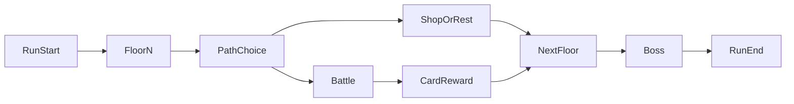

# ゲームデザイン文書（GDD）

## 文書情報

| 項目 | 内容 |
|------|------|
| 仮タイトル | **リンクコード・ディープラン**（Linkcode Deeprun） |
| プラットフォーム | Webブラウザ（GitHub Pages 等の静的ホスティング） |
| ジャンル | デッキ構築ローグライト（超短縮） |
| バージョン | 0.1（企画段階） |

本企画はネット空間・リンク・短時間デュエルといった**雰囲気のモチーフ**に寄せたオリジナル作品である。**既存作品の固有名詞・カード名・キャラクターは使用しない。**

---

## 1. 概要・ワンフレーズ

**ネットの深層を数フロア進み、戦闘でデッキを編成しながら最終ボス「コア」の前にたどり着き、一撃の勝負でランを完結させる。**

---

## 2. 想定プレイ時間

| 指標 | 目標 |
|------|------|
| 1ラン全体 | **8〜10分** |
| 戦闘1回 | 約1〜2分 |
| マップ上のノン戦闘イベント | 各30秒〜1分 |

**構造:** フロア **3**（各フロア終了時にデッキ編成の機会）＋ **最終ボス戦** でラン終了。中ボスは **1体**（フロア2終了時またはフロア3直前）を想定し、総戦闘回数は **通常戦4〜6回＋中ボス1＋最終ボス1** 程度に抑える。

---

## 3. コアピラー（体験の柱）

1. **短い意思決定の連続** — ターンが長引かないよう、手札とリソースに上限を設ける。
2. **「リンク」感のある盤面** — 隣接したカードを組み合わせて強い一度きりの効果を出す（後述のリンク合成）。
3. **再プレイ性** — カード報酬と経路選択で毎回デッキの形が変わる。MVPでは**メタ進行なし**でも成立するバランスを目指す。

---

## 4. ゲームループ

プレイヤーは各フロアで **ノードを1つ選択**（分岐は **最大2択**）。ノード種別に応じて戦闘・ショップ・休息などが発生し、戦闘後は **カード報酬** または **ゴールド** などでデッキが変化する。3フロア目終了後（または設計上マップの終端）で **最終ボス** に入る。

---

## 5. 戦闘ルール（MVP）

### 5.1 勝敗条件

- **プレイヤーHP** と **敵HP** を用意。いずれかが0以下で勝敗決定。
- ラン開始時のプレイヤーHPは **固定値**（例: 80）。休息ノードで一部回復可能。

### 5.2 リソース

- **エナジー（EP）**: ターン開始時に **最大まで回復**（最大値はバランス調整。初期案 **3**）。
- カードには **コスト（EP消費）** を記載。0コストのカードも少数用意。

### 5.3 手札・デッキ

- **手札上限** あり（初期案 **5**）。ターン終了時に上限を超えた分は捨て札へ。
- **デッキ枚数** 上限 **30**、下限 **15**（ショップ・報酬で増減してもこの範囲にクリップ）。
- ドロー: ターン開始時 **3枚**（調整可）。デッキが尽きたら **捨て札をシャッフルして山札** に（ローグライト定番のルール）。

### 5.4 「リンク合成」（本作独自のキーメカニク）

- 盤面に **リンクゾーン** として **スロット2枠**（左右）を置く。
- ターン中 **手札から最大2枚** をリンクゾーンに **隣接して** 置ける（左→右の順で配置すると合成判定）。
- **2枚が揃った瞬間** に「リンク合成」が発動:
  - 所定の **合成テーブル**（タイプの組み合わせ）に一致すれば、**合成結果カード1枚** の効果を **即時発動** し、使用済みの2枚は捨て札へ。
  - 一致しない組み合わせの場合は **「オーバーフロー」**: 低火力の全体ダメージのみ、または弱いドローなど **ペナルティ薄めの効果** に固定（ルール説明を簡単にするため）。
- リンクゾーンは **ターン終了時に空になる**（または次ターン開始時にリセット）。MVPでは **毎ターン1回まで** リンク合成可。

### 5.5 カードの属性（MVP）

カードは **タイプ** を1つ持つ（例: `kernel` / `packet` / `virus` / `shield`）。合成は主にタイプの組み合わせで決まる。攻撃・防御・ドロー・バフは **数値を小さく** 揃え、計算負荷を下げる。

### 5.6 敵の行動

- **意図アイコン**（次ターン攻撃 / 防御 / バフ）を **1つ** 表示する簡易AI。
- 雑魚は **パターン2〜3種**、ボスは **フェーズごとに意図が変わる** 程度に留める。

---

## 6. カード設計枠（データ上の制約）

| 項目 | MVPの目安 |
|------|-----------|
| 総カードプール（実装目標） | **25〜35種** |
| カードにつきキーワード | **2個以内** |
| レア度 | **3段階**（コモン / レア / レジェンド）— 出現率のみ差をつけ、効果は派手さに上限 |
| コストレンジ | 0〜4 EP |

---

## 7. マップ・進行

### 7.1 フロア構成

| フロア | 内容（案） |
|--------|------------|
| 1 | ノード **3〜4**。通常戦中心。分岐1回。 |
| 2 | ノード **3〜4**。**中ボス** を1回含む。 |
| 3 | ノード **2〜3**。ショップまたは休息を1つ挟み、次で最終ボスへ。 |

### 7.2 ノード種別（MVP）

| 種別 | 説明 |
|------|------|
| 戦闘 | 雑魚。勝利後 **カード3枚から1枚選択** または **ゴールド**。 |
| エリート | 報酬強め。HP差し引き大きめ。 |
| ショップ | ゴールドで **カード購入** / **1枚削除（サーバーに送る）**。 |
| 休息 | HPを **30%回復**、または **特定タイプのカード1枚を変換**（どちらか選択）。 |
| 謎 | **ランダム良イベント／小ペナルティ**（MVPでは省略可）。 |

---

## 8. 敵・ボス

| 役割 | 名前（作中コードネーム） | 概要 |
|------|--------------------------|------|
| 雑魚 | スパムワーム / パケットスナッチャー 等 | シルエット小さめ、行動単純。 |
| 中ボス | **ファイアウォール** | 壁・門のような見た目。防御寄り、意図読みが鍵。 |
| 最終ボス | **コア** | 球体コアと光。フェーズ **2** のみ（HP閾値で切替）。 |

---

## 9. 勝利・敗北・計分（MVP）

- **勝利**: 最終ボス撃破で **ランクリア**。表示は **クリアタイム** と **残りHP** のみ（スコア式は v2 検討）。
- **敗北**: HP0で **ラン終了**。リトライはメニューから即座にもう一度。

---

## 10. 技術前提

- **静的ファイルのみ**（HTML / CSS / JavaScript）。サーバ不要。
- セーブ: **localStorage** にラン中断データ（任意。MVPでは **中断なし** でも可）。
- カード・敵定義は **JSON**（または JS モジュールの定数）でホールド。
- ビルドツールは **任意**（初期はバニラ + モジュールでも可）。

---

## 11. スコープ外（v2 以降）

- メタ進行（永続アンロック、難易度上昇）
- 複数キャラ・スターターデッキ差分
- 日替わりデイリー、実績、クラウドランキング
- 多言語対応

---

## 12. リスクと対策

| リスク | 対策 |
|--------|------|
| リンク合成の組み合わせ爆発 | タイプを **4種程度に固定**、合成表を **表形式で限定**。 |
| バランス調整に時間が溶ける | カード枚数と敵種を **MVPで絞る**。数値は **CSVまたはJSON一括** で調整。 |
| 10分超え | フロア数・ノード数・敵HPを **データだけで削れる** 設計にする。 |
| 版権・ブランド | **オリジナル名称のみ**。実装・宣伝でも既存IPを連想させる表現を避ける。 |

---

## 13. コンセプトアート・プロンプト

画像生成用のプロンプトは別ファイルにまとめた。

**参照:** [concept-art-prompts.md](./concept-art-prompts.md)
